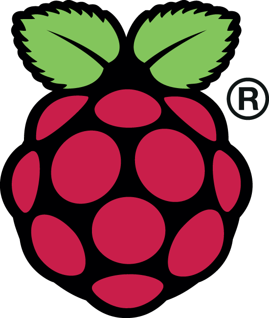

# Awesome Raspberry Pi 

> A curated list of Raspberry Pi operating systems, tools, projects, and learning resources.

The [Raspberry Pi](https://www.raspberrypi.com) is a series of small single-board computers developed by the Raspberry Pi Foundation, widely used for education, IoT, home automation, media servers, and hobbyist projects.

## Contents

- [Models](#models)
- [Operating Systems](#operating-systems)
- [Imaging & Provisioning Tools](#imaging--provisioning-tools)
- [Libraries & Dev Tools](#libraries--dev-tools)
- [Self-Hosted & Infrastructure](#self-hosted--infrastructure)
- [Media & Creative](#media--creative)
- [Hardware & GPIO](#hardware--gpio)
- [Networking & Security](#networking--security)
- [Learning Resources](#learning-resources)
- [Community](#community)

## Models

- [Raspberry Pi 5](https://www.raspberrypi.com/products/raspberry-pi-5/) - Flagship board with 2.4 GHz quad-core Arm Cortex-A76 and PCIe 2.0.
- [Raspberry Pi 500](https://www.raspberrypi.com/products/raspberry-pi-500/) - Pi 5 built into a keyboard form factor.
- [Raspberry Pi 4 Model B](https://www.raspberrypi.com/products/raspberry-pi-4-model-b/) - Previous-generation board with dual micro-HDMI and USB 3.0.
- [Raspberry Pi Zero 2 W](https://www.raspberrypi.com/products/raspberry-pi-zero-2-w/) - Compact board with quad-core 64-bit Arm and Wi-Fi.
- [Compute Module 5](https://www.raspberrypi.com/products/compute-module-5/) - Pi 5 in a compact module for embedded and industrial use.
- [Raspberry Pi Pico 2](https://www.raspberrypi.com/products/raspberry-pi-pico-2/) - Microcontroller board based on the RP2350 chip.

## Operating Systems

- [Raspberry Pi OS](https://www.raspberrypi.com/software/operating-systems/) - Official OS for Raspberry Pi.
- [Ubuntu for Raspberry Pi](https://ubuntu.com/download/raspberry-pi) - Ubuntu Server/Desktop images.
- [DietPi](https://dietpi.com/) - Lightweight Debian-based distribution.
- [Arch Linux ARM](https://archlinuxarm.org/platforms/armv8/broadcom/raspberry-pi-4) - Arch for ARM boards.
- [Armbian](https://www.armbian.com/raspberry-pi-4/) - Debian/Ubuntu-based SBC distribution.
- [Fedora ARM](https://fedoraproject.org/wiki/Architectures/ARM/Raspberry_Pi) - Fedora on Raspberry Pi.
- [Kali ARM](https://www.kali.org/get-kali/#kali-arm) - Security testing distro images.
- [LibreELEC](https://libreelec.tv/) - Kodi-focused media OS.
- [Lakka](https://lakka.tv/) - RetroArch-based console distro.
- [RetroPie](https://retropie.org.uk/) - Retro gaming environment.
- [OSMC](https://osmc.tv/) - Media center OS.
- [OpenWrt for Raspberry Pi](https://openwrt.org/toh/raspberry_pi_foundation/raspberry_pi) - Router/firewall distribution.
- [Home Assistant OS](https://www.home-assistant.io/installation/raspberrypi) - Appliance image for Home Assistant.
- [Volumio](https://volumio.com/) - Audiophile music player OS.
- [moOde Audio](https://moodeaudio.org/) - Audio distribution for Raspberry Pi.
- [OctoPi](https://octoprint.org/download/) - 3D-printer-focused image.

## Imaging & Provisioning Tools

- [Raspberry Pi Imager](https://github.com/raspberrypi/rpi-imager) - Official image writing tool.
- [balenaEtcher](https://etcher.balena.io/) - Cross-platform SD/USB image writer.
- [pi-gen](https://github.com/RPi-Distro/pi-gen) - Build custom Raspberry Pi OS images.
- [CustoPiZer](https://github.com/OctoPrint/CustoPiZer) - Customize Raspberry Pi OS images.
- [PiShrink](https://github.com/Drewsif/PiShrink) - Shrink disk images before distribution.
- [sdm](https://github.com/gitbls/sdm) - Fully customize Raspberry Pi OS images.
- [PiKISS](https://github.com/jmcerrejon/PiKISS) - Utility and installer script collection.
- [Pi-Apps](https://github.com/Botspot/pi-apps) - Community app installer for Raspberry Pi OS.

## Libraries & Dev Tools

- [GPIO Zero](https://github.com/gpiozero/gpiozero) - Beginner-friendly GPIO library.
- [pigpio](https://github.com/joan2937/pigpio) - Fast GPIO and peripheral control.
- [libcamera](https://github.com/libcamera-org/libcamera) - Camera stack used on modern Pi systems.
- [rpicam-apps](https://github.com/raspberrypi/rpicam-apps) - Raspberry Pi camera applications.
- [Picamera2](https://github.com/raspberrypi/picamera2) - Python camera library for libcamera.
- [Circle](https://github.com/rsta2/circle) - Bare-metal C++ environment.
- [Arduino-Pico Core](https://github.com/earlephilhower/arduino-pico) - Arduino core for RP2040/RP2350 boards.
- [k3sup](https://github.com/alexellis/k3sup) - Fast K3s bootstrap for Pi clusters.

## Self-Hosted & Infrastructure

- [Pi-hole](https://github.com/pi-hole/pi-hole) - DNS sinkhole and ad blocker.
- [AdGuard Home](https://github.com/AdguardTeam/AdGuardHome) - DNS filtering and parental controls.
- [Home Assistant](https://github.com/home-assistant/core) - Home automation platform.
- [PiKVM](https://github.com/pikvm/pikvm) - DIY KVM-over-IP appliance.
- [NextcloudPi](https://github.com/nextcloud/nextcloudpi) - Nextcloud appliance for Raspberry Pi.
- [RaspAP](https://github.com/RaspAP/raspap-webgui) - Turn Raspberry Pi into a router/AP.
- [PiVPN](https://github.com/pivpn/pivpn) - Simplified VPN server setup.
- [Navidrome](https://github.com/navidrome/navidrome) - Personal music streaming server.
- [Jellyfin](https://jellyfin.org/) - Open source media server.
- [Screenly Anthias](https://github.com/Screenly/Anthias) - Open source digital signage.
- [Uptime Kuma](https://github.com/louislam/uptime-kuma) - Self-hosted service monitoring.
- [Gogs](https://github.com/gogs/gogs) - Lightweight self-hosted Git service.
- [ShellHub](https://github.com/shellhub-io/shellhub) - Centralized remote SSH access.

### Media Automation Stack (*arr)

- [Sonarr](https://sonarr.tv/) - TV series collection manager.
- [Radarr](https://radarr.video/) - Movie collection manager.
- [Prowlarr](https://prowlarr.com/) - Indexer manager for Sonarr/Radarr/Lidarr/Readarr.
- [Lidarr](https://lidarr.audio/) - Music collection manager.
- [Readarr](https://readarr.com/) - Book and audiobook collection manager.
- [Bazarr](https://bazarr.media/) - Subtitle manager for Sonarr and Radarr.
- [Overseerr](https://overseerr.dev/) - Request management front-end for Plex/Jellyfin/Emby.
- [qBittorrent](https://github.com/qbittorrent/qBittorrent) - BitTorrent client used in many Pi media stacks.
- [Jackett](https://github.com/Jackett/Jackett) - Legacy indexer proxy still used in some setups.

## Media & Creative

- [MagicMirror²](https://github.com/MagicMirrorOrg/MagicMirror) - Smart mirror platform.
- [Raspotify](https://github.com/dtcooper/raspotify) - Spotify Connect client.
- [rpi-rgb-led-matrix](https://github.com/hzeller/rpi-rgb-led-matrix) - High-performance RGB matrix control.
- [InkyPi](https://github.com/fatihak/InkyPi) - E-ink dashboard framework.
- [Sonic Pi](https://github.com/sonic-pi-net/sonic-pi) - Live coding music environment.

## Hardware & GPIO

- [Official Raspberry Pi Documentation](https://github.com/raspberrypi/documentation) - Hardware, software, and tutorials.
- [Raspberry Pi Pinout](https://pinout.xyz/) - GPIO pin reference.
- [OpenCat](https://github.com/PetoiCamp/OpenCat-Quadruped-Robot) - Open source quadruped robot platform.
- [DonkeyCar](https://github.com/autorope/donkeycar) - DIY autonomous car stack.
- [Mycodo](https://github.com/kizniche/Mycodo) - Environmental monitoring and control.
- [gokrazy](https://github.com/gokrazy/gokrazy) - Build appliance-like Go systems for Pi.
- [GeerlingGuy PCIe Device List](https://github.com/geerlingguy/raspberry-pi-pcie-devices) - Pi 5 PCIe compatibility tracking.

## Networking & Security

- [WireGuard](https://www.wireguard.com/) - Modern VPN protocol.
- [Tailscale on Raspberry Pi](https://tailscale.com/kb/1114/pi) - Simple zero-config mesh networking.
- [cloudflared](https://github.com/cloudflare/cloudflared) - Tunnel local services securely.
- [CrowdSec](https://github.com/crowdsecurity/crowdsec) - Collaborative intrusion prevention.
- [Fail2ban](https://github.com/fail2ban/fail2ban) - Service log-based intrusion defense.
- [OpenMPTCProuter](https://github.com/Ysurac/openmptcprouter) - Multi-WAN aggregation.

## Learning Resources

### Official

- [Raspberry Pi Documentation](https://www.raspberrypi.com/documentation/)
- [Raspberry Pi Software](https://www.raspberrypi.com/software/)
- [Raspberry Pi Projects](https://projects.raspberrypi.org/)
- [Raspberry Pi Press](https://magpi.raspberrypi.com/)

### Tutorials

- [Jeff Geerling's Raspberry Pi Collection](https://www.jeffgeerling.com/tags/raspberry-pi)
- [Adafruit Raspberry Pi Learning Guides](https://learn.adafruit.com/category/raspberry-pi)
- [SparkFun Raspberry Pi Tutorials](https://learn.sparkfun.com/tutorials/tags/raspberry-pi)
- [Docker on Raspberry Pi (official docs)](https://docs.docker.com/engine/install/raspberry-pi-os/)
- [Kubernetes K3s Quick Start](https://docs.k3s.io/quick-start)

### Books

- [The Official Raspberry Pi Beginner's Guide](https://magpi.raspberrypi.com/books)
- [Raspberry Pi Cookbook (3rd Edition)](https://www.oreilly.com/library/view/raspberry-pi-cookbook/9781098130915/)
- [Programming the Raspberry Pi, Second Edition](https://pragprog.com/titles/d-ppp2/programming-the-raspberry-pi-second-edition/)

## Community

- [Raspberry Pi Forums](https://forums.raspberrypi.com/)
- [r/raspberry_pi](https://www.reddit.com/r/raspberry_pi/)
- [Raspberry Pi on X](https://x.com/Raspberry_Pi)
- [Raspberry Pi on YouTube](https://www.youtube.com/@RaspberryPi)

## Contributing

Contributions welcome! Read the [contribution guidelines](contributing.md) first.
